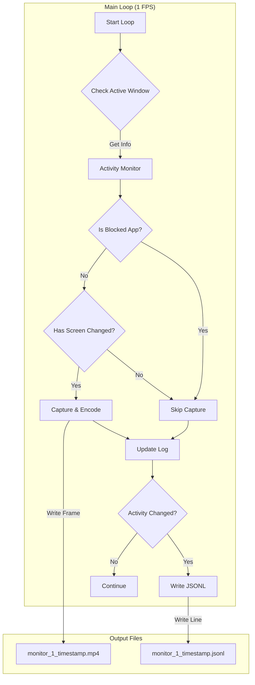

# 仕様変更: アクティビティベースのキャプチャ制御とログ記録

## 概要

画面キャプチャ時にアクティブなウィンドウ情報を取得し、特定のアプリケーション（Spotify, Slack等）やURLの場合はキャプチャをスキップする。同時に、作業内容（アプリ名、ウィンドウ名、期間）をログファイルに記録し、動画ファイルと紐付ける。

## アーキテクチャ



## データ構造

### ActivityLog (JSONL形式)

各行は1つの「アクティビティブロック（アプリやウィンドウが切り替わるまでの期間）」を表す。

**ファイル名**: `monitor_{id}_{timestamp}.jsonl`

**出力例**:
```json
{"start_time":"2024-11-28T10:00:00Z","end_time":"2024-11-28T10:15:30Z","app_name":"Visual Studio Code","window_title":"main.rs - prototype1","is_captured":true}
{"start_time":"2024-11-28T10:15:30Z","end_time":"2024-11-28T10:16:00Z","app_name":"Google Chrome","window_title":"Rust Documentation","is_captured":true}
{"start_time":"2024-11-28T10:16:00Z","end_time":"2024-11-28T10:30:00Z","app_name":"Spotify","window_title":"Spotify Free","is_captured":false}
{"start_time":"2024-11-28T10:30:00Z","end_time":"2024-11-28T10:35:00Z","app_name":"Slack","window_title":"#general","is_captured":false}
{"start_time":"2024-11-28T10:35:00Z","end_time":"2024-11-28T10:40:00Z","app_name":"Visual Studio Code","window_title":"capture.rs - prototype1","is_captured":true}
```

*   `is_captured`: `true` の場合は動画ファイルにこの期間の映像が含まれている（差分があった場合のみ）。`false` の場合はプライバシー保護のためキャプチャがスキップされており、動画には含まれない（または時間が飛んでいる）。

### 制御ロジック

1.  **アクティブウィンドウ取得**: `active-win-pos-rs` を使用。
2.  **ブラックリスト判定**:
    *   アプリ名: "Spotify", "Slack", "LINE" など
    *   ウィンドウ名: 部分一致で判定
3.  **キャプチャ判定**:
    *   **Blocked**: キャプチャしない。ログの `is_captured` = `false`。
    *   **Allowed**:
        *   差分あり: キャプチャする。
        *   差分なし: キャプチャしない（容量節約）。

## ファイル構成

保存先: `$HOME/.work_recorder/`

*   `monitor_{id}_{timestamp}.mp4`: 映像データ（可変フレームレート的）
*   `monitor_{id}_{timestamp}.jsonl`: アクティビティログ

## 今後の拡張性

*   ブラウザURL取得機能の実装（アクセシビリティAPI使用）
*   ログビジュアライザー（タイムライン表示）の実装
